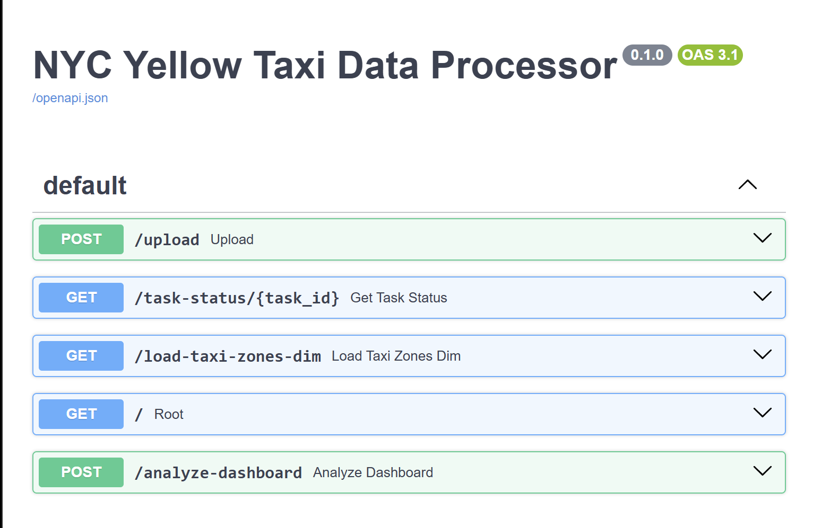
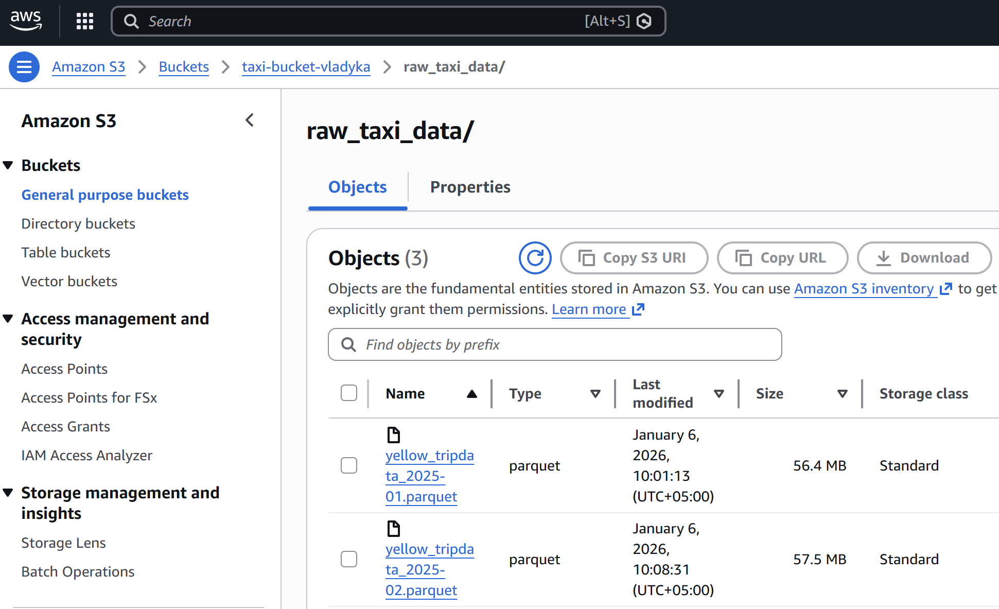
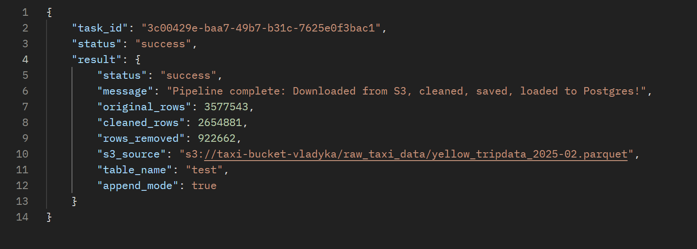
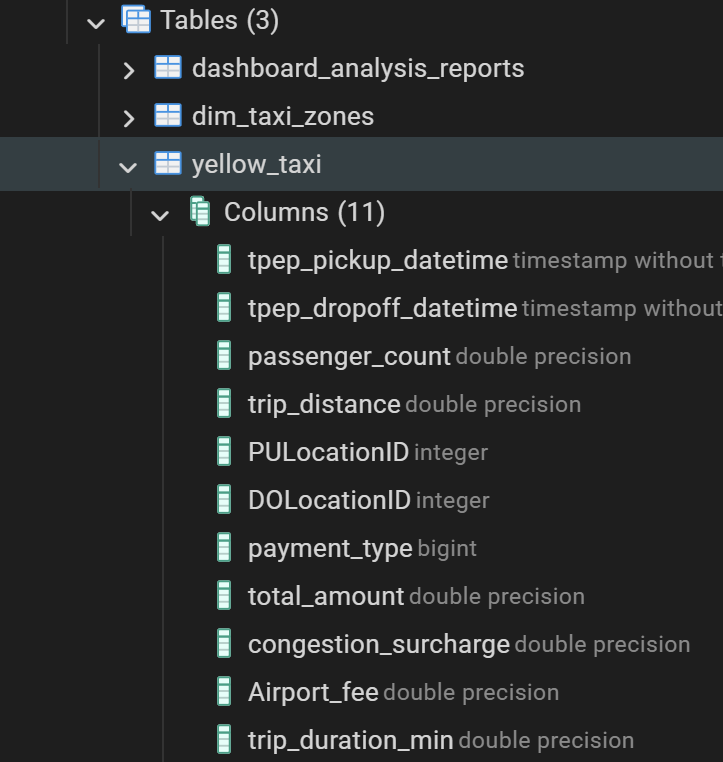
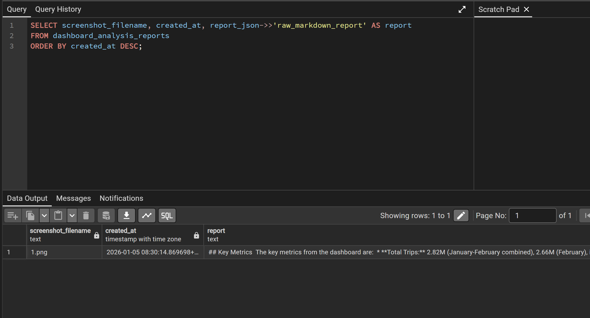

# NYC yellow taxi Data Endpoints

A **data warehousing project** built on the **NYC yellow taxi** database. This repository demonstrates a complete process of automated DWH.

## Features overview

This repository consists of a completed docker files that automatically load FastAPI, RabbitMQ, Celery, and Groq for reporting.

Tools used:
- FastAPI (Swagger)
- RabbitMQ
- Celery (manages the execution of tasks asynchronously in the background)
- AWS S3
- PostgreSQL 18
- Postman
- PowerBI
- Groq API

## Workload


This is FastAPI's main UI, where you can upload files, load dim zone table, check task status, and analyze PowerBI dashboard using Groq

When loading initial .parquet files to AWS S3, it would appear in a dedicated S3 bucket:



Here you can store raw .parquet files for backup purposes.

After loading to AWS S3, **RabbitMQ** automatically starts cleaning process as written in **tasks.py**. You can check current task's status using Postman:



Postman would show either 'queued', 'pending', 'failed', or 'success'. Screenshot above shows a successful .parquet ETL process from S3 to PostgreSQL server.



In PostgreSQL, you must create a separate table **'dashboard_analysis_report** for docker to load Groq's report in JSON format

It is done by using this command:
```
CREATE TABLE dashboard_analysis_reports (
    id SERIAL PRIMARY KEY,
    screenshot_filename VARCHAR(255) NOT NULL,
    report_json JSONB NOT NULL,
    created_at TIMESTAMP WITH TIME ZONE DEFAULT CURRENT_TIMESTAMP,
    note TEXT
);

-- Optional: index for fast queries --
CREATE INDEX idx_dashboard_reports_filename ON dashboard_analysis_reports(screenshot_filename);
CREATE INDEX idx_dashboard_reports_created_at ON dashboard_analysis_reports(created_at);
```

Then, load PostgreSQL server in PowerBI to create a dashboard for AI to analyze for you:


After building a report, load a screenshot of that report to FastAPI/analyze-dashboard for Groq to build a report and load it to PostgreSQL in JSON format.

If successful, you can either download the report in HTML format (optional) or check in PostgreSQL server which would result in this output:



